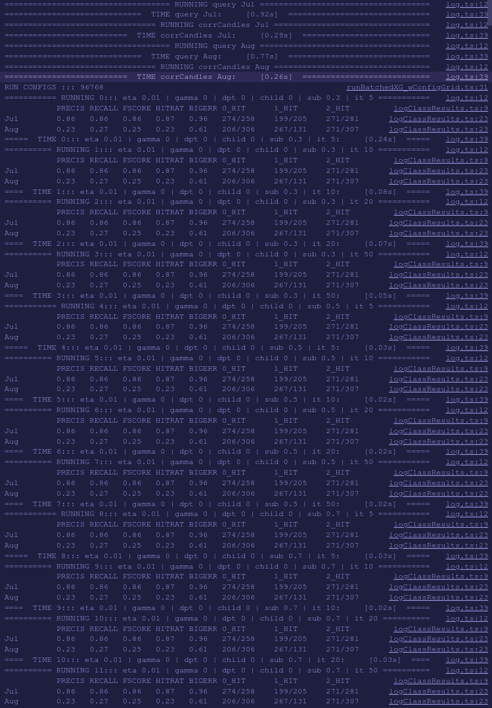

# Electron ML/NN Research for Crypto Trading

Core idea: try different models (XGBoost, LSTM, SVM, etc) to predict Crypto price direction (not the price itself!) based on features (usually technical indicators, like SMA, RSI, etc).

This is my personal testing ground, the goal here is to experiment, get results and evaluate ideas as fast as possible, everything else is secondary. Therefore, a lot of configuration is simply in the form of comment/uncomment lines in code.

## Price Direction

This is a very important concept. A lot of tutorials try to predict price, but:

- That's more difficult
- As a trader, I don't really care

I care more about direction, with a certain threshold, like +3% after 1 day. But you need a way to define that. Throughout this project, I'm using the Triple Barrier labeling method from "Advances in Financial Machine Learning" by de Prado. In short, you define up/down threshold (+/- X%) and time window (1 day), and each point gets labeled by
which threshold it hits first, or neutral if it runs out of time window.

For example, here is triple labeled BTC price from 2018-07-01 to 2018-08-01.

- green = up
- yellow = neutral
- red = down


Actually, once you get to Reinforcement Learning (RL), you realize you don't care about direction also, you care about actions and profits. But that's for another time.

## Modes

Has 2 modes - UI (Electron) and Console (Node).

- UI (Electron) used for single runs when there is a need to inspect a single chart visually, like looking at the price and predicted direction (up/down/neutral).
- Console (Node) used for long running-loops, e.g. Grid Tests or Genetic Algo (GA) optimization.

## Flow

Overall data/function flow is like this:

1. Query train+test data from SQLite DB
2. Calculate features/indicators
3. Train Model
4. Test/Evaluate Model
5. Display (chart/console) and save(csv) results:

- MSE, R2 if regression
- Precision, Recall, F-Score if classification

## Features / Models

`strat/run` is the launch panel. Each file under this dir is a separate runnable model. `strat/run.ts` is the entry file where a model is selected. To switch between models, uncomment the line in `strat/run.ts` like:
`import { runBatchedXG as runn } from "./run/runBatchedXG";` (by uncommenting the line).

1. `runBatchedXG.ts` => runs XGBoost model

- Can switch between classification and regression (through `/run/config/runConfig.ts` `XG_OBJECTIVE` prop)
- Modes: Electron / Node

2. `runBatchedLSTM.ts` => runs LSTM model

- Can switch between different LSTM libs
  - Tensorflow (`mlLSTMTF.ts`)
  - Synaptic (`mlLSTMSynapticClass.ts`)
  - Neataptic (`mlLSTMNeatapticClass.ts`)
- For Tenforflow, has multiple switchable model config examples in `models/ml`, to switch, uncomment line in `mlLSTMTF.ts`, like:
  `import model from "./models/v5_VanillaClass";`

- Modes: Electron / Node

3. `runBatchedXG_all.ts` => loops through all features defined in features/index.ts (getAllPart1/2/3) and calculates prediction evaluation results (MSE, R2, FScore) for test data set.

- Modes: Node

4. `runBatchedXG_wConfigGrid.ts` => takes a grid of XGBoost params (eta, gamma, depth, etc) and loops through all of them, saving results in CSV.

- Modes: Node

5. `runBatchedXG_wGA.ts` => takes a single feature and tries to GA optimize XGBoost params.

- Modes: Node

6. `runIndProb.ts` => calculates price direction (up/down/neutral) staticics, based on indicator+threshold (like `RSI < 20`) events.

- Modes: Node

7. `runSVM.ts` => runs SVM model

- Modes: Electron / Node

8. `runRL.ts` => runs RL model

- Calls external Python RL service (not included un open-source version)
- Modes: Electron / Node

## Config

There are several configurable variables (through code). Availability depends on the Model used.

1. date range (train+test) => you can get predefined ones from runUtils like `runUtils.genRanges_FastMiniTest()`. In `/data_temo` I've only included just enough for `genRanges_FastMiniTest()`, so please use that.
2. features => which features to use for prediction? Each feature can be an array of multiple indicators. When using Electron mode, you usually use a single feature and then inspect the result visually. In Node mode, it's about looping through multiple features and getting classification/regression results for each one.
3. Barrier Type/Label => up/down thresholds and time window
4. Model => mainly depends on which `/run` script you use but also sometimes provides additional switch inside, like in LSTM you can switch between 3 libs.
5. Model params
6. GA/Grid => have arrays for each model params to search/loop/optimize through

- XGBoost params are inside `/run/config/runConfig.ts`
- LSTM params (and pre-configured models) are inside `/ml/models`
- SVM params are inside `/ml/mlSVM.ts`

## Install

There is some magic behind the scenes to make this runnable on both Electron and Node. See `Magic` section, if you are interested, what's going on.

```bash
# Clone this repo
git clone git@github.com:deandreee/electron_ml_nn_research.git
# cd to repo
cd electron_ml_nn_research
# switch to specific node version (install nvm if don't already have)
nvm install 12.8.1
nvm use 12.8.1
# magic init script
./init/run.sh
```

## Run

It is heavily suggested to run this with VS Code to execute all the pre-launch/build tasks and use the right args automatically (defined in `.vscode/launch.json`)

1. Open VS Code
2. Go to Debug tab
3. Choose `ELECTRON` or `NODE` mode
4. Press F5
   1. In `ELECTRON` mode, you should see a chart after a few seconds. If nothing happens, press Ctrl+Shift+I to open DevTools console and look for an error. If there is a message about "DevTools disconnected", press F5 and check console again.
   2. In `NODE` mode, you should see some output in the console.

## Magic

Installing dependencies for Electron is not the easiest task.
Installing for both Electron and Node simultaneously is even more difficult.
I wanted the code to be runnable from both Electron and Node quickly, without a long rebuild, so I implemented a hack.

Native dependencies (C/C++) are the ones that cause problems. They need to be built for a specific Node version. And even though I have synced this project so that they both use the same Node version (12.8.1.), `NODE_MODULES_VERSION` is still not the same, therefore we need to install dependencies separately for both of them. `./init/run.sh` is configured to do that for you. First, it installs dependencies for Node, moves them to `node_modules_node`, then rebuilds for Electron and moves that to `node_modules_electron`. When you run the code, VS Code pre-launch tasks are configured to switch `node_modules` symlink to the right one.

## Data

For quick demo purposes, I've included a small SQLite data sample (in `data_demo`) with BTC/ETH/XRP 1m candles from 2018-03-01 to 2018-09-01.

## Platforms Compatability

Should work on Unix like systems (OSX included). I haven't had time to test with too many though. Sorry Windows users, this requires custom ./init/run.sh.

## Screenshots

Below are some screenshots demonstrating features/models in action.

### runBatchedXG.ts

Regression predicting price 1 day forward. Filtered by >+1% or <-1% to reduce noise.

**Electron mode**:


**Node mode**:


### runBatchedXG.ts

Classification predicting triple barrier label with +/-3% up/down threshold (green = up, yellow = neutral, red = down)

**Electron mode**:


**Node mode**:


### runBatchedXG_wConfigGrid.ts



### runBatchedXG_all.ts


### runBatchedXG_wGA.ts


### runIndProb.ts


